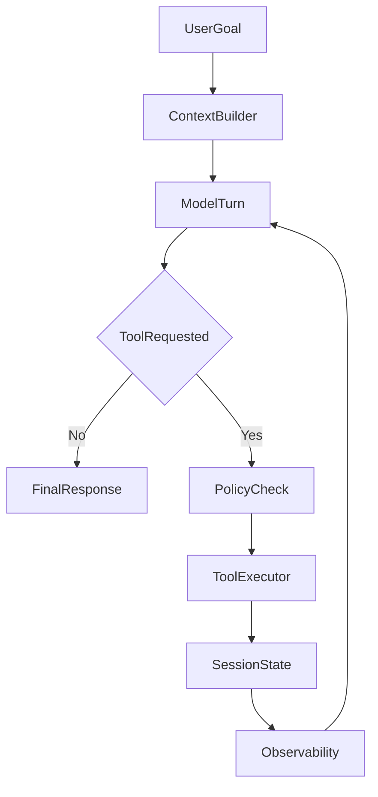

# Build Your Own Agents

Build AI agents with the same architecture patterns used by Claude Code — without a framework and without reverse-engineering it yourself.

This repo gives you the production checklist, 6 worked examples, and a runnable Python agent you can clone and adapt to your domain in 30 minutes.

## The Problem This Solves

When you ask an AI coding agent to "build me an agent," you get a script that calls an API once and prints the answer. That is not an agent. It is a wrapper.

Production agents like Claude Code use a fundamentally different architecture: a controller loop, tool contracts with schemas, runtime permission enforcement, session state with compaction, hook pipelines for safety, observability, and evaluation.

You should not have to study a production codebase to learn these patterns. **This skill packages them so your coding agent produces production-grade designs automatically.**

## What Changes When You Install This Skill

| Without this skill | With this skill installed |
|---|---|
| One-shot script | Loop-based controller that iterates until the task is done |
| No tool boundaries | Explicit tool contracts with schemas, permissions, and timeouts |
| No safety | Runtime permission enforcement (auto-allow / ask-first / deny) — the same tiered model used by Claude Code |
| No approval flow | Human-in-the-loop approval before high-risk actions |
| No memory | Structured session state with persistence and compaction |
| No logging | Structured JSON observability for every tool call and turn |
| No evaluation | Quality rubrics, safety metrics, and testing cadence |
| No failure handling | Classified failures with bounded retries and graceful degradation |
| "Ship it" | Rollout phases from prototype to production |

## Clone And Run In 5 Minutes

Requires **Python 3.10+** and an [Anthropic API key](https://console.anthropic.com/).

```bash
git clone https://github.com/xuanhieu2611/build-your-own-agents-skill.git
cd build-your-own-agents-skill/examples/marketing-agent
pip install -r requirements.txt
export ANTHROPIC_API_KEY="your-key"
python -m src.main "Draft a LinkedIn post for our developer toolkit launch"
```

The marketing agent will loop through fetching trends, reading the campaign brief, drafting posts, requesting your approval before publishing, and logging every step — the same loop architecture that powers production coding agents.

## What Patterns This Is Based On

I studied how Claude Code's agent harness works — the runtime, not the model — and extracted the durable architecture patterns that make it reliable:

- **Controller loop**: model proposes, runtime validates, executes, observes, repeats
- **Tool contracts**: JSON Schema input, declared permission level, timeout, side effects
- **Permission pipeline**: PreToolUse / PostToolUse hooks that can allow, deny, modify, or annotate tool calls before and after execution
- **Permission modes**: ReadOnly, WorkspaceWrite, DangerFullAccess — each tool declares what it needs, the runtime enforces it
- **Session compaction**: when context exceeds a threshold, older history is summarized while recent turns are preserved in full
- **Structured events**: every model turn produces typed events (text, tool_use, usage, cache, stop) that the runtime can inspect and act on

These are not theoretical patterns. They are how a production agent that millions of people use actually works.

## How It Works

**Step 1 — Design.** Install the skill and ask your coding agent to design an agent for your domain. The skill ensures it covers all production concerns automatically.

**Step 2 — Scaffold.** Use the scaffolder skill to turn the design spec into a structured Python project with controller loop, tool stubs, permissions, state, and observability.

**Step 3 — Build.** Replace the mock tool executors with your real integrations. The architecture stays the same.

## Quick Install

### Cursor
Copy [`skills/production-agent-architecture/`](skills/production-agent-architecture/) into your project at `.cursor/skills/production-agent-architecture/`.

### Claude Code / Codex / Gemini CLI / other AI coding tools
Copy the same folder into the tool's supported skills or prompt-library directory, or attach the markdown files directly to your build prompt.

## Copyable Prompt
After installing the skill, give your coding agent this:

```text
Use the production-agent-architecture skill.

Design a production-ready AI agent for [your domain].

Do not return a one-shot chatbot design.

Include: Agent Build Spec, controller loop pseudocode, tool contract table,
session state schema, permissions and approval matrix, failure and retry
strategy, observability minimums, evaluation plan, and rollout phases.
```

## Two Skills

| Skill | What it does |
|-------|-------------|
| [`production-agent-architecture`](skills/production-agent-architecture/SKILL.md) | Generates a complete Agent Build Spec for any domain |
| [`agent-scaffolder`](skills/agent-scaffolder/SKILL.md) | Turns a spec into a runnable Python project |

## 6 Worked Examples

| Example | Domain | What's included |
|---------|--------|----------------|
| [`marketing-agent`](examples/marketing-agent/) | Content automation | Full spec + **runnable Python code** |
| [`support-agent`](examples/support-agent/) | Customer support triage | Full spec |
| [`devops-incident-agent`](examples/devops-incident-agent/) | Incident response | Full spec |
| [`code-review-agent`](examples/code-review-agent/) | Automated PR review | Full spec |
| [`data-pipeline-agent`](examples/data-pipeline-agent/) | Pipeline monitoring | Full spec |
| [`research-agent`](examples/research-agent/) | Literature review | Full spec |

## Architecture

Every agent built with this skill follows the same loop pattern used by production coding agents:



## Docs

**Start here:**

| Doc | What it covers |
|-----|---------------|
| [`getting-started.md`](docs/getting-started.md) | Fastest path for humans and AI agents |
| [`what-is-an-ai-agent.md`](docs/what-is-an-ai-agent.md) | The mental model: loop + tools + state + permissions |
| [`agent-architecture-overview.md`](docs/agent-architecture-overview.md) | The reusable seven-step pattern and core components |
| [`before-after-comparison.md`](docs/before-after-comparison.md) | Naive prompting vs skill-guided output |

**Deep dives:**

| Doc | What it covers |
|-----|---------------|
| [`agent-tooling-system.md`](docs/agent-tooling-system.md) | Four-layer tool architecture: spec, registry, executor, result |
| [`agent-tool-schemas-and-contracts.md`](docs/agent-tool-schemas-and-contracts.md) | Contract anatomy, schema design, versioning |
| [`agent-permissions-and-safety.md`](docs/agent-permissions-and-safety.md) | PreToolUse/PostToolUse hooks, permission modes, sandboxing |
| [`agent-context-and-prompting.md`](docs/agent-context-and-prompting.md) | Dynamic system prompts, layered context, prompt caching |
| [`agent-memory-and-sessions.md`](docs/agent-memory-and-sessions.md) | Session state, compaction, persistence, forking |
| [`agent-observability-and-audit.md`](docs/agent-observability-and-audit.md) | Structured logging, metrics, tracing, audit trails |
| [`agent-evaluation-and-testing.md`](docs/agent-evaluation-and-testing.md) | Offline replay, shadow mode, A/B, human audit |
| [`agent-reliability-and-failures.md`](docs/agent-reliability-and-failures.md) | Failure types, retry strategies, circuit breaking |
| [`agent-approval-and-hitl-workflows.md`](docs/agent-approval-and-hitl-workflows.md) | Approval flows, channels, timeouts, escalation |
| [`agent-mcp-and-extensibility.md`](docs/agent-mcp-and-extensibility.md) | MCP protocol, plugin architecture, when to add extensibility |
| [`agent-orchestration-and-product-design.md`](docs/agent-orchestration-and-product-design.md) | Product commands, multi-agent coordination, UX patterns |

## Why I Built This

I wanted to understand how serious agent systems actually work, so I studied the Claude Code agent harness in depth — the controller loop, the tool registry, the permission pipeline, the session system, the hook architecture.

Most of that knowledge is locked up in proprietary codebases. This repo extracts the durable architecture patterns and makes them available to everyone, so you can build a production-grade agent for your domain without spending weeks figuring out the plumbing.

## Publishing Position
This repository is inspired by architecture patterns observed in modern coding agents such as Claude Code. It is independently written, not affiliated with Anthropic, and intended as practical build guidance. No proprietary source code is included in this repository.

## Contributing

See [`CONTRIBUTING.md`](CONTRIBUTING.md). Good contributions: better examples, stronger skill outputs, clearer docs, more realistic production guidance.

## License

MIT. See [`LICENSE`](LICENSE).
