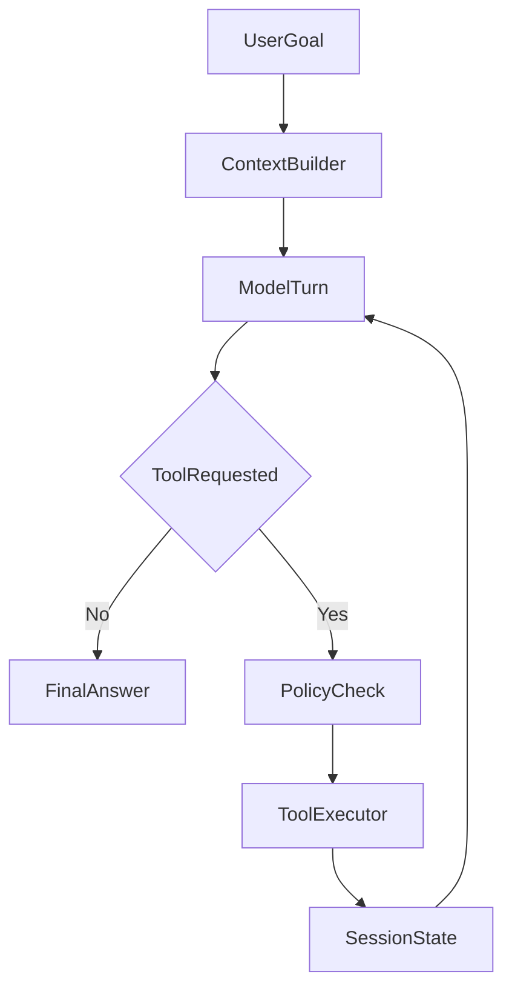

# Build Your Own Agents Skill

A reusable skill, documentation set, and example kit for building production-ready AI agents.

I am a software engineer who studied the Claude Code agent harness closely because I wanted to understand how serious agents are actually built. This repo is my attempt to turn that learning into something clean and useful: a public skill and knowledge base that helps developers and AI coding agents build their own agents without spending weeks reverse-engineering harness patterns.

## What This Repo Is
- a reusable skill for AI coding agents
- a practical architecture guide for human developers
- a set of worked examples for real, non-trivial agents
- a production-readiness checklist covering eval, reliability, observability, approvals, and tool contracts

## What This Repo Is Not
- not a source mirror
- not affiliated with Anthropic
- not a full framework or hosted platform
- not just another prompt that says "build me an agent"

## Start Here In 3 Minutes
1. Read [`skills/claude-style-agent-architecture/SKILL.md`](skills/claude-style-agent-architecture/SKILL.md).
2. Open [`examples/marketing-agent/agent-build-spec.md`](examples/marketing-agent/agent-build-spec.md).
3. Give both to your coding agent and ask it to design your agent for your domain.
4. If you want the human explanation first, read [`docs/getting-started.md`](docs/getting-started.md).

## Quick Install

### Cursor
Copy [`skills/claude-style-agent-architecture/`](skills/claude-style-agent-architecture/) into your project at `.cursor/skills/claude-style-agent-architecture/`.

### Claude Code / Codex / Gemini CLI / Antigravity / similar tools
Copy the same folder into the tool's supported skills or prompt-library directory, or attach the markdown files directly to your build prompt.

### Generic usage
If your setup can consume markdown files, start with:
- [`skills/claude-style-agent-architecture/SKILL.md`](skills/claude-style-agent-architecture/SKILL.md)
- [`skills/claude-style-agent-architecture/reference.md`](skills/claude-style-agent-architecture/reference.md)
- one example from [`examples/`](examples/)

## Copyable Prompt
Use this with your coding agent after you attach the skill and one example:

```text
Use the claude-style-agent-architecture skill from this repo.

Design a production-ready AI agent for [your domain].

Do not return a one-shot chatbot design.

Include:
- Agent Build Spec
- controller loop pseudocode
- tool contract table
- session state schema
- permissions and approval matrix
- failure and retry strategy
- observability minimums
- evaluation plan
- rollout phases from prototype to production
```

## What The Skill Should Output
A good run should produce more than a vague architecture paragraph. It should give you:
- an `Agent Build Spec`
- controller loop pseudocode
- tool contracts
- session state schema
- permissions and approval matrix
- failure and retry strategy
- observability minimums
- evaluation plan
- rollout phases from prototype to production

## Best First Example
Start with [`examples/marketing-agent/agent-build-spec.md`](examples/marketing-agent/agent-build-spec.md).

It shows how to design an agent that:
- fetches trending topics
- drafts posts
- requests approval before publishing
- publishes content
- tracks analytics
- iterates based on results

## Docs Map
- [`docs/getting-started.md`](docs/getting-started.md): fastest path for humans and AI agents
- [`docs/what-is-an-ai-agent.md`](docs/what-is-an-ai-agent.md): beginner-friendly explanation
- [`docs/agent-architecture-overview.md`](docs/agent-architecture-overview.md): the reusable architecture pattern
- [`docs/claude-style-agent-architecture-guide.md`](docs/claude-style-agent-architecture-guide.md): main handoff guide
- [`docs/build-your-own-agent-roadmap.md`](docs/build-your-own-agent-roadmap.md): practical build order
- [`docs/agent-observability-and-audit.md`](docs/agent-observability-and-audit.md), [`docs/agent-evaluation-and-testing.md`](docs/agent-evaluation-and-testing.md), [`docs/agent-reliability-and-failures.md`](docs/agent-reliability-and-failures.md): the production layer
- [`docs/publishing-checklist.md`](docs/publishing-checklist.md): what to do before you publish the repo and announce it

## Architecture Snapshot


## Why I Built This
I wanted a repo where people could land, understand quickly how serious agent systems work, grab one skill, and start building their own domain agent.

The point is not to copy one vendor product exactly.

The point is to extract the durable architecture ideas that make coding agents powerful and then make them usable for everyone.

## Publishing Position
This repository is inspired by architecture patterns seen in modern coding agents such as Claude Code, but it is independently written, architecture-focused, and intended as practical build guidance.
